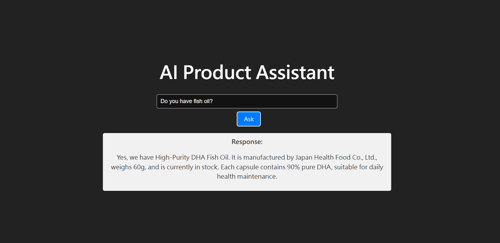

# RAGQueryAI

## Overview

RAGQueryAI is an AI-powered assistant that leverages **Retrieval-Augmented Generation (RAG)** using **LangChain, Ollama, and ChromaDB** to answer product-related queries. The backend is built with **Flask (Python)** for AI processing and **Express.js (Node.js)** for API routing, while the frontend is developed using **React.js**.

## 🚀Features

- **Retrieval-Augmented Generation (RAG)** for accurate AI-driven responses
- **Vector-based search with ChromaDB** for efficient query handling
- **Ollama LLM & embeddings** to process and retrieve relevant product information
- **SQLite database integration** for structured product details
- **React.js frontend (powered by Vite)** for a simple and user-friendly UI
- **Express.js middleware** to connect frontend and backend APIs
- **Flask API** for AI model execution and query handling
- **LangChain** for building retrieval and AI-assisted workflows

  

## 📚Tech Stack

### **Backend**

- Python (Flask)
- LangChain (Ollama LLM, ChromaDB VectorStore)
- SQLite for structured data
- SQLAlchemy for database operations

### **Frontend**

- React.js
- Axios (API calls to backend)

### **Middleware/API Gateway**

- Node.js (Express.js)
- Axios (Proxy requests to Flask API)

## ⚙️Installation & Setup

### **1️⃣ Clone the Repository**

```sh
git clone https://github.com/YOUR_USERNAME/RAGQueryAI.git
cd RAGQueryAI
```

### **2️⃣ Backend Setup**

```sh
cd backend
python -m venv venv
source venv/bin/activate  # On Windows use: venv\Scripts\activate
pip install -r requirements.txt
```

Run the Flask API:

```sh
python rag_api.py
```


### **3️⃣ Frontend Setup**

```sh
cd frontend
npm install
npm run dev
```


### **4️⃣ Middleware/API Gateway Setup**

```sh
cd backend
node server.js
```


## 💻Usage

1. Open the frontend at `http://127.0.0.1:5173`
2. Ask product-related questions in the input box
3. The system retrieves structured data from SQLite or performs vector search with ChromaDB
4. AI-generated responses are displayed  



## 📂Folder Structure

```
RAGQueryAI/
│── backend/
│   ├── db/              (SQLite database & ChromaDB files)
│   ├── venv/            (Python virtual environment)
│   ├── rag_api.py       (Flask API with RAG processing)
│   ├── server.js        (Express.js middleware)
│   ├── requirements.txt (Python dependencies)
│   ├── package.json     (Node.js dependencies)
│── frontend/
│   ├── src/             (React components)
│   ├── public/          (Static assets)
│   ├── App.jsx          (Main React component)
│   ├── package.json     (React dependencies)
│── .gitignore
│── README.md
```

## License

This project is licensed under the MIT License.

## Contributors

- **Guan-Wei Huang**  
For questions or suggestions, feel free to contact:  
Email: gwhuang24@gmail.com
